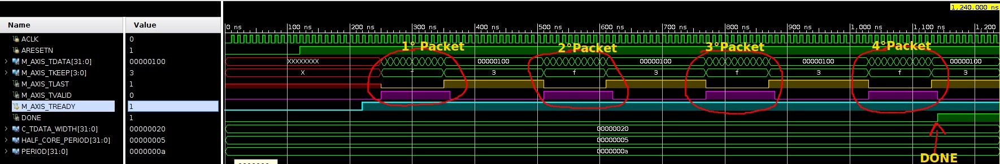

# Net2axis
Verilog network module for simulation. Models network traffic from pcap to AXI-Stream

Table of Contents
=================

   * [Net2axis](#net2axis)
   * [Table of Contents](#table-of-contents)
      * [Introduction](#introduction)
      * [Why use net2axis ?](#why-use-net2axis-)
      * [Dependencies](#dependencies)
      * [Usage](#usage)
         * [Verilog module instantiation](#verilog-module-instantiation)
         * [net2axis.py tool](#net2axispy-tool)
      * [Usage example](#usage-example)
      * [Testbench](#testbench)

## Introduction
Net2axis is a **simulation-only** Verilog module that generates Master
AXI-Stream transactions from network packets described in packet capture files
([PCAP](https://en.wikipedia.org/wiki/Pcap)). It provides a convenient way for a
user to develop his/hers network hardware design by simulating a Network/Ethernet/MAC/Internet
Protocol
[IP cores](https://en.wikipedia.org/wiki/Semiconductor_intellectual_property_core).

## Why use net2axis ?
Development of a network design in hardware can be very troublesome. Even
when designing over simple protocols,
[ARP](https://en.wikipedia.org/wiki/Address_Resolution_Protocol) 
for instance, creation of a consise testbench can take time. 

As FPGA vendors are increasily adopting AXI4 protocol, such as 
[Xilinx](https://www.xilinx.com/support/documentation/ip_documentation/ug761_axi_reference_guide.pdf),
their proprietary network-related IPs are using AXI-Stream channels send network
traffic data to (your) custom IP module. Net2axis can be used to model those
proprietary IPs in simulation.

There are advantages on using PCAP files as input:

* They can be captured in a real-world network using
[tcpdump](http://www.tcpdump.org/) or [whireshark](https://www.wireshark.org/),
  providing your custom IP with a confident data input.

* They can be easily created in software with [scapy](https://scapy.net/), for
   instance, even enabling description of new protocols.

## Dependencies
The project dependencies are:

* Python 2.7.X
* Scapy 2.X

The provided testbed project example depends on Xilinx Vivado (tested on version
`2017.2`). However, net2axis testbench and module will probably simulate in others HDLs
tools as well. 

## Usage
In a glance, net2axis is formed by two component:

* A python script (`tool/net2axis.py`)
* A verilog module (`hdl/net2axis.v`), which models network IP cores and
  generates Master AXI-Stream transactions.

The following picture shows the net2axis workflow:

```
+-------------------+                          +------------------+
|                   |                          |                  |
| PCAP file (.pcap) |--->[tool/net2axis.py]--->| DATA file (.dat) |--->[hdl/net2axis.v] 
|                   |                          |                  |
+-------------------+                          +------------------+
```

The input PCAP file read by the `net2axis.py` that generates a intermediate DATA
file, which filename should be configured in the `C_INPUTFILE` parameter of `net2axis.v`.

### Verilog module instantiation
It is pretty straightforward to instantiate the net2axis verilog module. Its
parameters and ports are:

* Parameters:
  * `C_INPUTFILE`: (_Mandatory_) : Path to the intermediate DATA file. Absolute path is recommended. 
  * `C_TDATA_WIDTH`: (_Optional_) : AXI-Stream TDATA bus width in bits. Default 32.
* Ports:
  * `ACLK`: Clock
  * `ARESETN`: Active-low reset
  * `M_AXIS_*`: Master AXI-Stream interface
  * `DONE`: Active-high **done** signal. Goes high when after the last packet is
    transmitted, i.e., the model reaches the end of DATA file.
	
See `sim/net2axis_tb.v` as an instantiation example.

### `net2axis.py` tool
The `net2axis.py` script has the following command line options:

```bash
$ ./tool/net2axis.py -help
usage: net2axis.py [-h] [-w [DATAWIDTH]] [-i [INITDELAY]] [-d [DELAY]]
                   [-e [ENDIANNESS]]
                   pcapfile

positional arguments:
  pcapfile              Input PCAP file

optional arguments:
  -h, --help            show this help message and exit
  -w [DATAWIDTH], --datawidth [DATAWIDTH]
                        Data bus width (in bits)
  -i [INITDELAY], --initdelay [INITDELAY]
                        Initial packet delay
  -d [DELAY], --delay [DELAY]
                        Inter packet delay
  -e [ENDIANNESS], --endianness [ENDIANNESS]
                        Set endianness
```

Where:
* `-w` : Set the TDATA bus width in bits. Default: 32
* `-i` : Set initial delay (in clock cycles), i.e., first packet's
  delay. Default: 0
* `-d` : Set delays (in clock cycles) between packets. Default: 10
* `-e` : Endianness (`little` or `big`). Default: `little`

The output DATA file will be the same name of input PCAP file, however with
`.dat` extension.

## Usage example
First of all, clone the repository and `cd` to it and set exec permission on
`net2axis.py` script:

```bash
$ chmod +x tool/net2axis.py
```

Having cloned the repository in `/home/user/net2axis` and using a PCAP file, say
`tcp.pcap`, generate the intermediate file `tcp.dat`
using `TDATA` width of 32 bits:

```bash
$ ./tool/net2axis.py tcp.pcap
```

Finally, instantiate `net2axis` module in your Verilog code using (preferably) the absolute path to
the intermediate file as argument of `C_INPUTFILE` parameter:

```verilog
    net2axis #(
        .C_INPUTFILE      ("/home/user/net2axis/tcp.dat"),
        ) net2axis_0 (
        .ACLK             (ACLK            ),
        .ARESETN          (ARESETN         ),
        .DONE             (DONE            ),
        .M_AXIS_TVALID    (M_AXIS_TVALID   ),
        .M_AXIS_TDATA     (M_AXIS_TDATA    ),
        .M_AXIS_TKEEP     (M_AXIS_TKEEP    ),
        .M_AXIS_TLAST     (M_AXIS_TLAST    ),
        .M_AXIS_TREADY    (M_AXIS_TREADY   ));
```

**That's all folks!!**

## Testbench

A simple testbench is provided in the project to show how to used it. A TCL
`tcl/net2axis_sim.tcl` script creates a Vivado project and simulates using a
PCAP file containing 4 ARP packets as input.

Running `make sim` creates the project and runs in batch mode, which output each
clock cycle of packet being sent. First column is timestamp, second is `TVALID`
signal, third is `TDATA`, fourth is `TKEEP` and the last is `TLAST`.

```
$ make sim
[.... lots of log ....]
[120.00 ns] Reset deasserted
[221.00 ns] 0 | xxxxxxxx | x | x
[230.00 ns] Starting packet 1 after delay of 0 clock cycles
[251.00 ns] 1 | ffffffff | f | 0
[261.00 ns] 1 | bbaaffff | f | 0
[271.00 ns] 1 | 010000cc | f | 0
[281.00 ns] 1 | 01000608 | f | 0
[291.00 ns] 1 | 04060008 | f | 0
[301.00 ns] 1 | bbaa0100 | f | 0
[311.00 ns] 1 | 010000cc | f | 0
[321.00 ns] 1 | 00000000 | f | 0
[331.00 ns] 1 | ffffffff | f | 0
[341.00 ns] 1 | 000affff | f | 0
[351.00 ns] 1 | 00000100 | 3 | 1
[361.00 ns] 0 | 00000100 | 3 | 1
[390.00 ns] Starting packet 2 after delay of 10 clock cycles
[511.00 ns] 1 | ffffffff | f | 0
[521.00 ns] 1 | bbaaffff | f | 0
[531.00 ns] 1 | 010000cc | f | 0
[541.00 ns] 1 | 01000608 | f | 0
[551.00 ns] 1 | 04060008 | f | 0
[561.00 ns] 1 | bbaa0100 | f | 0
[571.00 ns] 1 | 010000cc | f | 0
[581.00 ns] 1 | 00000000 | f | 0
[591.00 ns] 1 | ffffffff | f | 0
[601.00 ns] 1 | 000affff | f | 0
[611.00 ns] 1 | 00000100 | 3 | 1
[621.00 ns] 0 | 00000100 | 3 | 1
[650.00 ns] Starting packet 3 after delay of 10 clock cycles
[771.00 ns] 1 | ffffffff | f | 0
[781.00 ns] 1 | bbaaffff | f | 0
[791.00 ns] 1 | 010000cc | f | 0
[801.00 ns] 1 | 01000608 | f | 0
[811.00 ns] 1 | 04060008 | f | 0
[821.00 ns] 1 | bbaa0200 | f | 0
[831.00 ns] 1 | 010000cc | f | 0
[841.00 ns] 1 | 0100000a | f | 0
[851.00 ns] 1 | 00ccbbaa | f | 0
[861.00 ns] 1 | 000a0100 | f | 0
[871.00 ns] 1 | 00000100 | 3 | 1
[881.00 ns] 0 | 00000100 | 3 | 1
[910.00 ns] Starting packet 4 after delay of 10 clock cycles
[1031.00 ns] 1 | ffffffff | f | 0
[1041.00 ns] 1 | bbaaffff | f | 0
[1051.00 ns] 1 | 010000cc | f | 0
[1061.00 ns] 1 | 01000608 | f | 0
[1071.00 ns] 1 | 04060008 | f | 0
[1081.00 ns] 1 | bbaa0100 | f | 0
[1091.00 ns] 1 | 010000cc | f | 0
[1101.00 ns] 1 | 0100000a | f | 0
[1111.00 ns] 1 | ffffffff | f | 0
[1121.00 ns] 1 | 000affff | f | 0
[1131.00 ns] 1 | 00000100 | 3 | 1
[1240.00 ns] Simulation finished
```

Running `make sim-gui` does the same simulation, but executes Vivado GUI, where
you can graphically see the waveforms. The following figure is the testbench
result as well:


